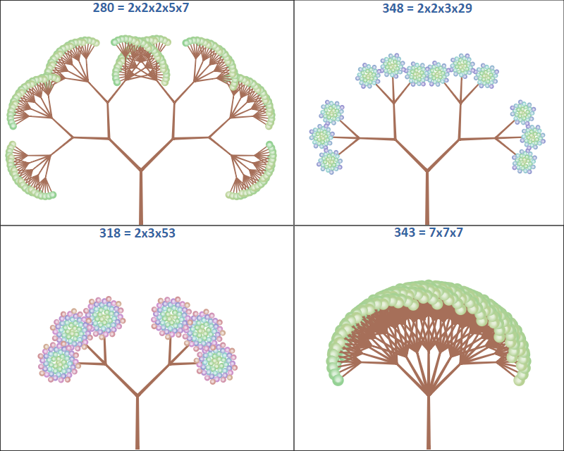

Testing the idea of "plant-like" prime factorization visualization in [Elm](http://elm-lang.org/).

See the [blog post](http://blog.ruslans.com/2015/07/prime-factorization-elms.html) for details.

Live [demo](http://www.ruslans.com/elm-prime-trees).

