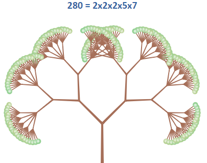

Testing the [idea](http://blog.ruslans.com/2013/08/growing-prime-factorization-plants.html) of "plant-like" prime factorization visualization in [Elm](http://elm-lang.org/).

Live [demo](http://www.ruslans.com/elm-prime-trees).

